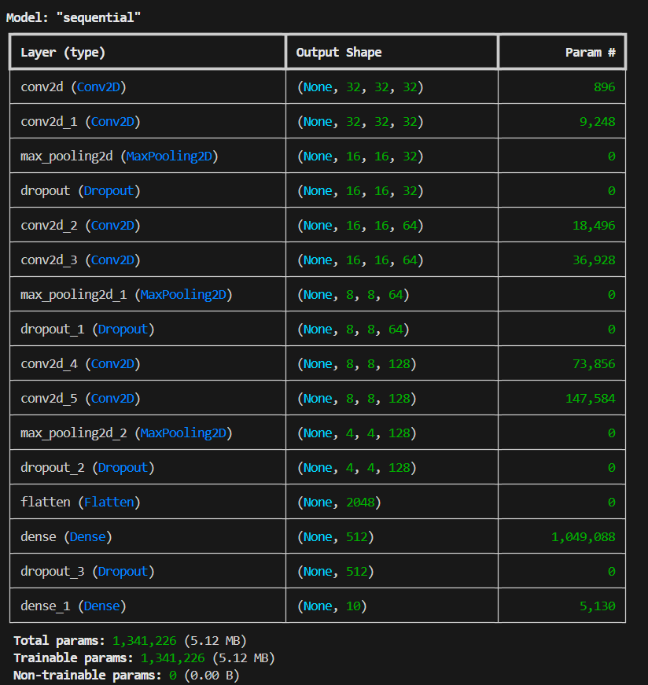
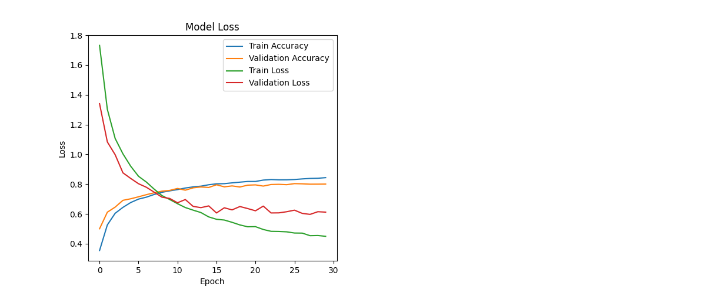
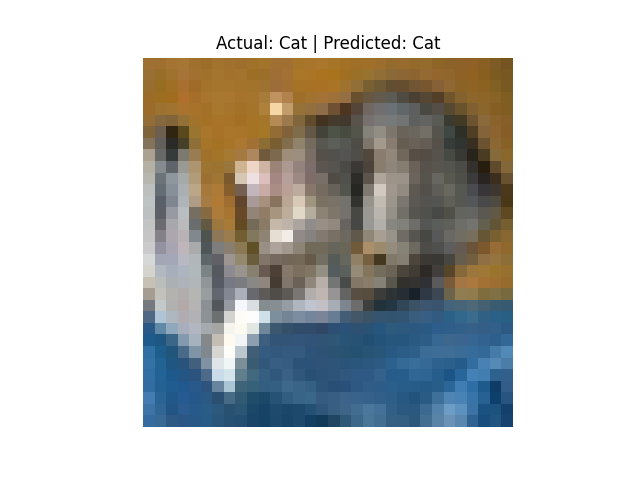
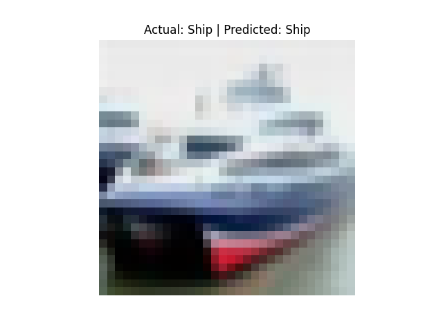
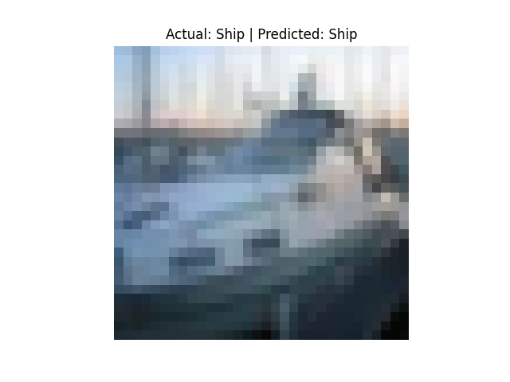
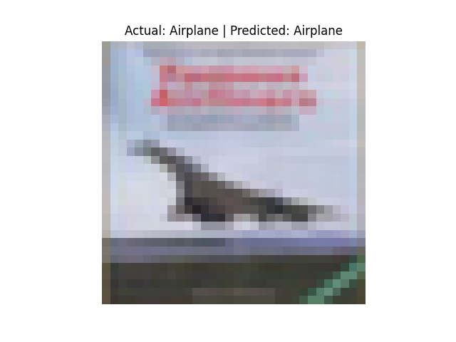
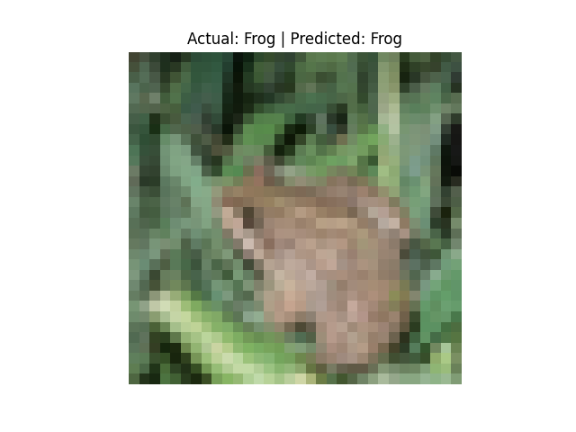

# CIFAR-10 Image Classification

## Data Preprocessing

Using `tensorflow` and `keras`, load the cifar-10 dataset into a (trainX,trainY) (testX,testY) split. Then normalize the pixels of trainX and testX to the range [0,1] to improve model stability. 
The possible labels for this dataset of images are ['Airplane','Automobile','Bird','Cat','Deer','Dog','Frog','Horse','Ship','Truck']. Next, encode the labels (trainY, testY) into a 10 dimensional vector to do multiclass classification. Visuals of 16 labeled images are plotted using `pyplot`.

## Model Initialization
Since the dataset consists of images, a convoluted neural network is used to classify data. The general process of creating the model is as follows:
- create 2 convoluted layers with `relu` activation to extract spatial features (32, (3,3)) 
- add `MaxPooling2D` to reduce the feature map size
- use `Dropout` to prevent overfitting by disabling neurons randomly when training (0.25 until flattening layers)
- create 2 more convoluted layers (64,(3,3)) with `MaxPooling2D` and `Dropout` layers added after
- create 2 more convoluted layers (128,(3,3)) with `MaxPooling2D` and `Dropout` layers added after
- flatten the layers with `model.add(layers.Flatten())`
- add a `Dense` layer with 512 and `relu` activation
- add the final `Dropout` layer with 0.5
- add the final `Dense` layer with 10 and `softmax` activation (used to get probabilty scores for classes)

Then, compile the model with the adam optimizer, accuracy metric, and `categorical_crossentropy` as the loss function.

## Model Training
The CNN model is trained with:
- 30 `epochs` (cycles of training)
- `batch_size` of 64 (meaning 64 images per batch for the best gradient updates)
- `validation_split` to help with overfitting & generalization
The loss and accuracy results are stored in the `history` variable for plotting model accuracy and loss.

The more training cycles, the less training and validation loss, though there is more validation loss than training loss. Similarly the more training cycles, accuracy is higher for both training and validation data.

## Model Prediction
Recall that the possible labels are ['Airplane','Automobile','Bird','Cat','Deer','Dog','Frog','Horse','Ship','Truck'].
The process for classifying an image is as follows:
- get an image from `testX`
- get the true class label from `testY`
- calculate the model prediction (the index of the label)
- using the index, get the predicted label

The model correctly labels all 5 test images.

