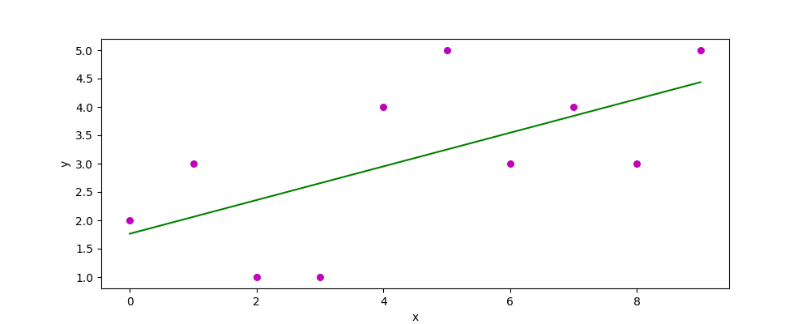
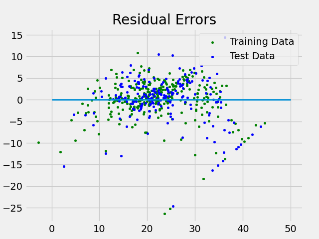

# Linear Regression Models

Uses numpy, matplotlib.pyplot, seaborn, sklearn, and pandas to perform linear regression on basic data and multiple linear regression on a dataset split into training and test data.

## Single Linear Regression
Using predefined arrays of data, where x is the independent variable and y is the dependent variable, calculate the regression line (line of best fit).

` x = np.array([0,1,2,3,4,5,6,7,8,9])`
` y = np.array([2,3,1,1,4,5,3,4,3,5])`

With the above data, estimate the coefficients of the regression line using the least squares method. This method is as follows:
1. Determine the total number of datapoints with `np.size(x)` (as both arrays are the same size)
2. Find the mean of both x and y using `np.mean()`
3. Calculate the cross deviation of x and y using 
`np.sum(y*x)-(n*meanY*meanX)`
4. Calculate the deviation about x using `np.sum(x*x)-(n*meanX*meanX)`
5. Calculate the regression coefficients `b0` and `b1` using `b1=cross_devXY/devX` and `b0=meanY-(b1*meanX)`

Using the coefficients and original data, create a scatterplot and the regression line by calculating the predicted response vector with `yPred=b0+(b1*x)`.

Estimated coefficients: 1.7636363636363637 and 0.296969696969697

## Multiple Linear Regression

Using the Boston Housing dataset (https://lib.stat.cmu.edu/datasets/boston), split the data into training and testing data.

Then, initialize the linear regression model and fit it using the training data, trainX and trainY.

Determine the regression coefficients using `.coef_` on the linear regression model. Note that the closer the coefficient is to 1 the better.

Regression coefficients:
 [-8.95714048e-02  6.73132853e-02  5.04649248e-02  
 2.18579583e+00   -1.72053975e+01  3.63606995e+00  
 2.05579939e-03   -1.36602886e+00  2.89576718e-01 
 -1.22700072e-02 -8.34881849e-01   9.40360790e-03
 -5.04008320e-01]

Next, determine the varience score using `.score` on the model, where varience is calculated by 
`1-varience(y_actual-y_predicted)/varience(y_actual)`

Varience score: 0.7209056672661754

Now create a scatter plot of residual errors (difference between actual and predicted values) in the training data and testing data, and then plot the line of 0 error.

Errors in training data are green and errors in test data are blue.

