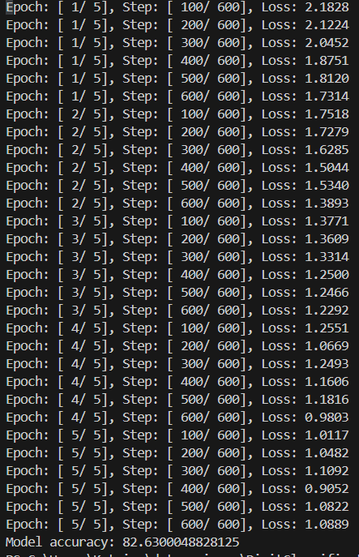

# Classifying Digits with Logistic Regression

Uses Python and Pytorch to load the MINST digit dataset and train a logistic regression model.

## Logistic Regression Class

Create a logistic regression class that takes pytorch.nn.Module as its input. It has 2 functions:
- **__init__**: A constructor that takes `self`, `inputSize`, and `numClasses`, calls the superclass constructor, and then sets its `linear` to `nn.Linear(inputSize, numClasses)`.
- **forward**: Calculates softmax with forward pass using `self.linear(x)`, where x is an image.

## Logistic Regression Model

Split and load the MINST digit dataset into training and testing data. Next, define the hyperparameters as follows:
- `inputSize=784` - since images are 28x28 which is 784 pixels
- `numClasses=10` - since there are 10 possible labels for each image (0-9)
- `epochs-5` - run training 5 times
- `batchSize=100` - train on 100 image batches to prevent memory overflow
- `learningRate=0.001`
Then create the Logistic Regression model using Pytorch, the `inputSize` and `numClasses`. 
Set the loss function to use cross entropy with `crit=nn.CrossEntropyLoss()` and set the optimizer to use stochastic gradient descent with `learningRate` with `optimize=torch.optim.SGD(model.parameters(),lr=learningRate)`.

### Training the Model

In each epoch, enumerate through the training data and store the index and (image,label) tuple. Set the images with `img=Variable(img.view(-1,28*28))` and labels with `label=Variable(labels)`. Next, reset the gradients to 0 with `optimize.zero_grad()`. Complete the forward pass with `output=model(img)` and record the output. Calculate the loss with `loss=crit(output,labels)`, where `crit` is the cross entropy loss defined above. Then perform the backwards step with `loss.backwards()`. Lastly, update the weights of the model with `optimize.step()`.

## Results

Track the number of correct labels and the number of total attempts to classify the test data. For each image and label in the test data, get the image (same as in training the model) and run the model with `output=model(img)`. Next, find the predicted values using `_,pred = torch.max(output.data)` and increment the total images processed. Increment the correct predictions if `pred==labels`.

After 5 epochs, the model achieves **82.6%** accuracy.