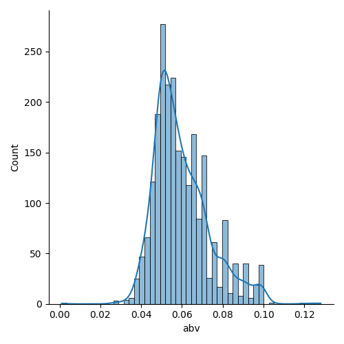
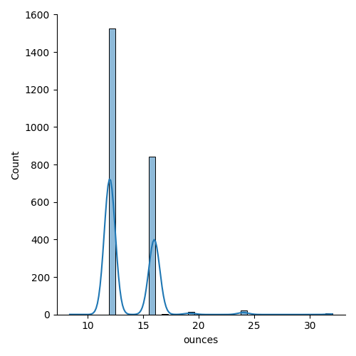

# Exploratory Data Analysis
Generates and plots descriptive statistics of beers & breweries datasets using seaborn and pyplot.

### Data Cleaning
Merge the two datasets on `brewery_id` and `id` to create a joint dataset. Then, determine the column categories needed in a dataframe by identifying unique columns. The categories are:

| Column | Type |
|--------|------|
|abv     | numeric|
|ibu     |numeric|
|id | numeric|
|name|categorical|
|style|categorical|
|brewery_id|numeric|
|ounces|numeric|

### Descriptive Statistics of Numerical Values

#### Numerical Values in Columns

Determine the number of numerical values in each column for the series by finding the length of each column. `brewery_id` and `id` were not included.

|Column|Length|
|---|---|
|ibu|2410|
|abv|2410|
|ounces|2410|

#### Non-Null Values
Find the number of non-null values in each numerical column (`brewery_id` and `id` not included) by using `count()`.

|Column|Non-Null Values|
|---|---|
|ibu|1405|
|abv|2348|
|ounces|2410|

Then, determine the percentage of null values in each numerical column using the following calculation:

`((length_of_column - count_of_missing_values)/length_of_column)*100`

|Column|Percentage of Missing Values|
|---|---|
|ibu|41.7%|
|abv|2.6%|
|ounces|0%|

#### Minumum & Maximum Values
Min and Max values of each numerical column (`brewery_id` and `id` not included) are determined using `min()` and `max()`.

|Column|Min|Max|
|---|---|---|
|ibu|4.0|20.0|
|abv|0.001|0.128|
|ounces|8.4|32.0|

#### Mean, Median, Mode, & Standard Deviations of Numerical Columns
Mean, median, mode and standard deviations of each numerical column (`brewery_id` and `id` not included) are determined using the following functions: `mean()`, `median()`, `mode()`, `std()`.

|Column|Mean|Median|Mode|Standard Deviation|
|---|---|---|---|---|
|ibu|42.713|35.0|20.0|25.954|
|abv|0.0598|0.056|0.05|0.0135|
|ounces|13.592|12.0|12.0|2.352|

#### Quantile Statistics
Quantile statistics are used to determine data spread, skewedness and outliers.
To determine quantile statistics, split the data into equal sized groups using cut points (quantiles). For example:
`beers['ibu'].quantile([0.25,0.5,0.75])`

|Column|0.25|0.5|0.75|
|---|---|---|---|
|ibu|21.0|35.0|64.0|
|abv|0.050|0.056|0.067|
|ounces|12.0|12.0|16.0|

#### Frequency Distribution Plots
For each numerical column, use seaborn and pyplot to create distribution plots of numerical columns while dropping missing values.

##### ibu Distribution

##### abv Distribution

##### ounces Distribution

### Correlations of Numerical Values
Correlations between numerical values are determined using Pearson's correlation coefficient and the `corr()` function.

||abv|ibu|ounces|
|---|---|---|---|
|abv|1.0|0.670|0.172|
|ibu|0.670|1.0|0.054|
|ounces|0.172|0.054|1.0|

This indicates that ibu and abv are moderately correlated with 0.670, while ibu and ounces are not very correlated with 0.054.

### Descriptive Statistics of Categorical Values

||name|style|
|---|---|---|
|count|2410|2405|
|unique|2305|99|
|top|Nonstop Hef Hop| American IPA|
|freq|12|424|

