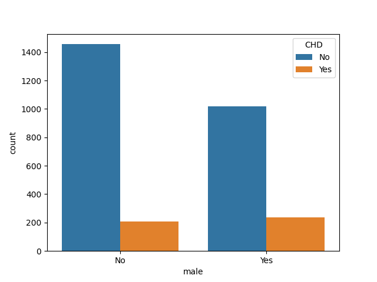
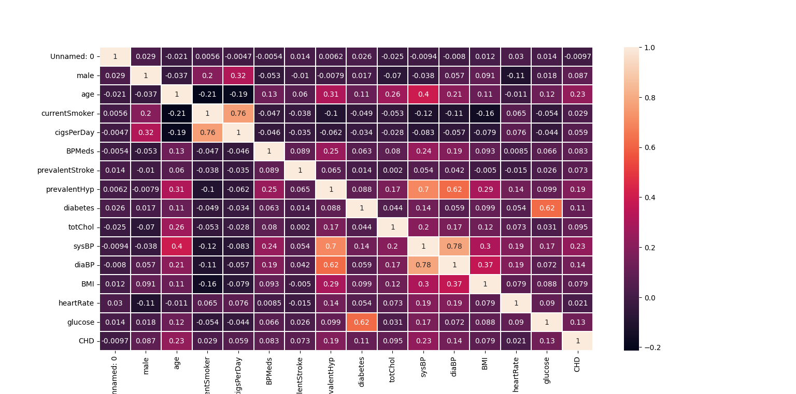
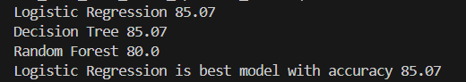

# Heart Disease (CHD) Prediction

Uses `numpy`, `pandas`, `matplotlib.pyplot`, `seaborn`, and `sklearn` to preprocess heart disease data, create plots, train 3 models (logistic regression, decision tree, and random forest), and determine the optimal model for predicting heart disease development.

## Data Preprocessing

### Initial Preprocessing

The following steps were done to preprocess the data:
- read `dataset.csv` into a pandas dataframe
- drop the `education` column, as it doesn't affect heart disease development
- rename `TenYearCHD` to `CHD`
- define `x`, and `y` to store data from the dataframe to use in training

### Training Preprocessing

Split `x` and `y` into `trainX`, `trainY`, `testX`, and `testY` using `train_test_split` with an 80/20 train-test split. For plotting, temporarily concatenate `trainX`&`trainY` and `testX`&`testY`.

Using the training data, we can see the number of males and females that develop CHD.

With the training data, create a correlation heatmap.

We can see that the following variables are highly (>0.6) correlated:
- cigsPerDay and currentSmoker (0.76)
- sysBP and prevalentHyp (0.7)
- diaBP and prevalentHyp (0.62)
- glucose and diabetes (0.62)
- sysBP and diaBP (0.78)

In order to reduce inflation, we remove the following outliers in the training data:
- `sysBP` > 220
- `BMI` > 43
- `heartRate` > 125
- `glucose` > 200
- `totChol` > 450

Standardize the columns with outliers removed into an array: `age`,`cigsPerDay`,`totChol`,`sysBP`,`BMI`,`heartRate`,`glucose`. Use `StandardScaler()` to fit_transform the training data with the columns back into the training dataframe.
 
Next, fill the null values in the test data with the most frequent values using `SimpleImputer`.

## Model Prediction

Model prediction is done in 3 seperate functions, and the accuracy score is returned. 

### Logistic Regression

Fit `sklearn`'s `LogisticRegression()` model with the training data (`trainX`, `trainY`). Using the fitted model, predict the values using `testX`. Determine the accuracy score using the predicted values and actual (`testY`) values.

### Decision Tree

Create a `DecisionTree()` with max_depth of 3 and fit it with the training data. Then, predict the target values using `testX`. Determine the accuracy score using the predicted values and `testY`.

### Random Forest

Use `RandomForest()` with 3 estimators and fit it with the training data and k-nearest neighbour. Predict the target values using `testX`. Determine the accuracy score using the predicted values and `testY`.

## Results

After training, we can see that Logistic Regression is the optimal model for heart disease prediction on this dataset.