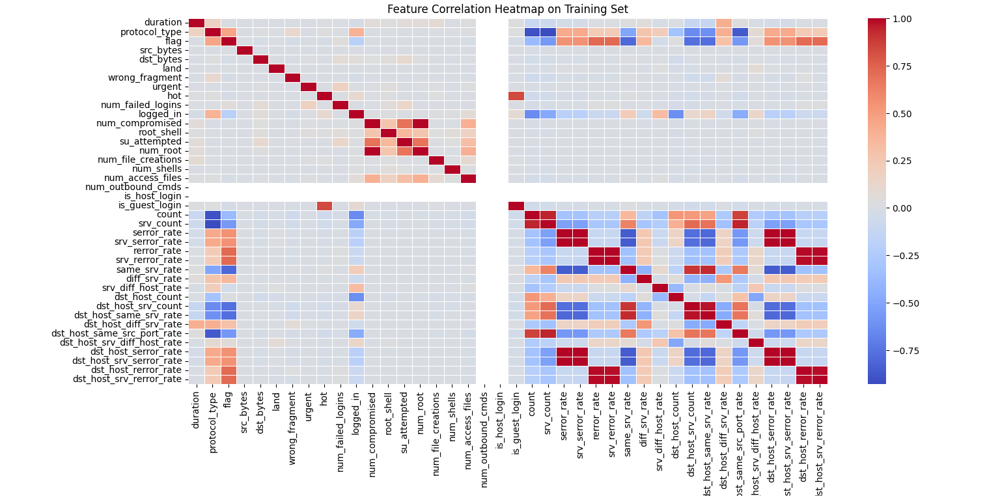
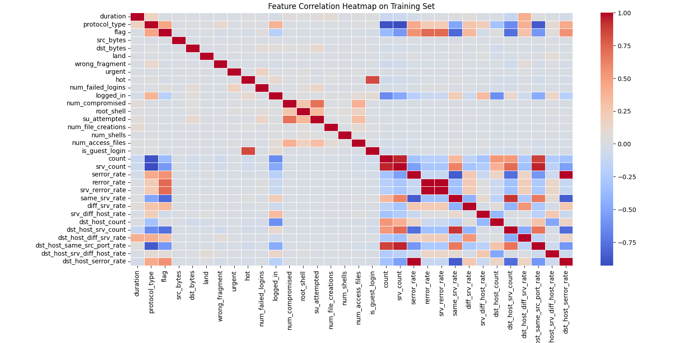

# Intrusion Detection

Uses Python, pandas, NumPy, Matplotlib, seaborn, and Scikit-Learn to identify accuracy of models trained on connection and attack data. 

## Overview
A predictive model that can differentiate between bad connections, called intrusions/attacks, and good connections. Attack categories include:
- DOS/DDOS: denial of service ex) syn flooding
- R2L: unauthorized access from remote machine
- U2L: unauthorized access to local superuser privileges ex) buffer overflow
- probing: ex) port scanning

## Data Preprocessing

## Identifying Correlations

Determine the correlations between all numeric features of the training data (trainX).

**Figure 4**: Correlation heatmap of all numeric features of `trainX`

Remove the following highly correlated features to increase model interpretability and reduce redundancy:
- num_root
- srv_serror_rate
- dst_host_srv_serror_rate
- dst_host_rerror_rate
- dst_host_srv_rerror_rate
- dst_host_same_srv_rate

Remove columns that don't add value from `trainX` and `testX`:
- is_host_login, num_outbound_cmds
- service

Determine the correlations between the transformed numeric features of the training data (trainX).

**Figure 5**: Correlation heatmap without highly correlated numeric features

## Model Training

Before training, use `MinMaxScaler()` to fit_transform `trainX` and `testX`. The following models were trained:
- **Naive Bayes** with `GaussainNB()`
- **Decision Tree** with entropy and max depth of 4
- **Random Forest** with `n_estimators=30`
- **Support Vector Machine (SVM)** with `LinearSVC()`
- **Logistic Regression** with max iterations of 1200000
- **Gradient Boosting** with `n_estimators=30`, max depth of 4, and random state 0

The process of training a model is:
1. Track start time of training
2. Fit the model with `model.fit(trainX, trainY.values.ravel())`
3. Determine time taken for training model on training data
4. Track start time of predicting
5. Predict on training data with `model.predict(trainX)`
6. Predict on test data with `model.predict(testX)`
7. Determine time taken for predictions on test data
8. Calculate accuracy scores for training data with `accuracy_score(trainY, predTrain)*100`
9. Calcualte accuracy scores for test data with `accuracy_score(testY, predTest)*100`

## Results

