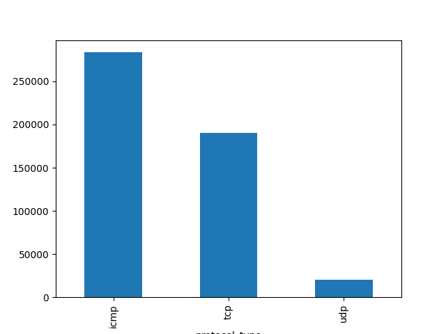
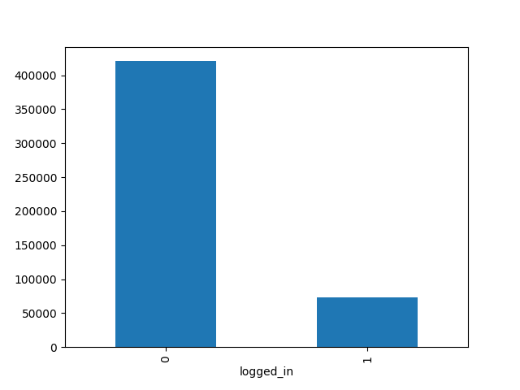
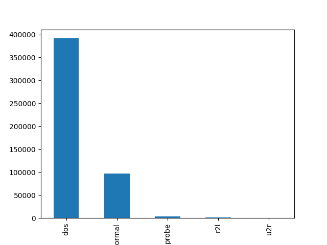
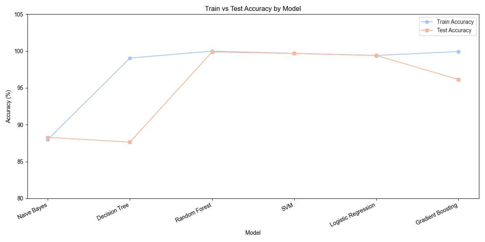
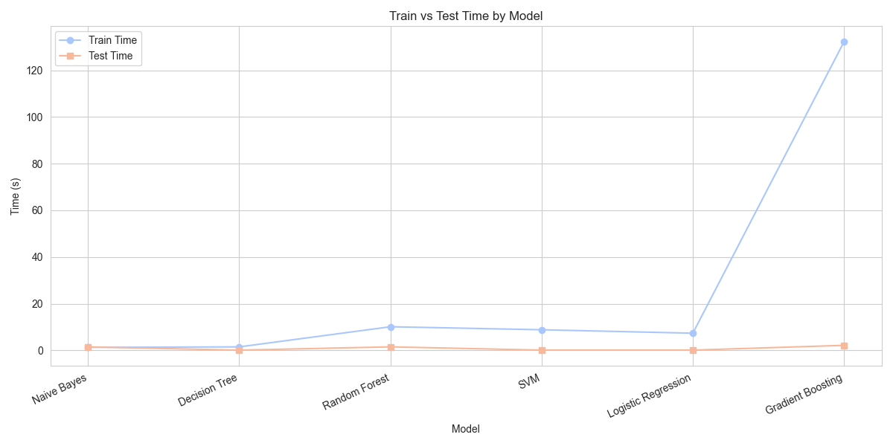

# Intrusion Detection

Uses Python, pandas, NumPy, Matplotlib, seaborn, and Scikit-Learn to identify accuracy of models trained on connection and attack data. 

## Overview
A predictive model that can differentiate between bad connections, called intrusions/attacks, and good connections. Attack categories include:
- DOS/DDOS: denial of service ex) syn flooding
- R2L: unauthorized access from remote machine
- U2L: unauthorized access to local superuser privileges ex) buffer overflow
- probing: ex) port scanning

## Data Preprocessing

Read `kddcup.data_10_percent_corrected` into a dataframe. Create a dictionary of attack types & categories and then add `Attack Type` column to the dataframe using `lambda`.

#### Plotting & Identifying Categorical Features
- Find all categorical features and store them in `categories`
- Remove `target` and `Attack Type` from `categories`
- Plot categorical features

**Figure 1**: Bar plot of `protocol_type` with the counts of icmp, tcp, udp

**Figure 2**: Bar plot of the number of `logged_in` values, where 0 is not logged in and 1 is logged in

**Figure 3**: Bar plot showing the number of different attack types (dos, normal, probe, r2l, u2r)

#### Creating trainX and testX

`trainX`and `testX` were created using the following process:
- Drop `target` column from the dataframe
- Filter the numeric columns into a seperate dataframe
- Create target variable `y` with data from `Attack Type`
- Create a feature matrix `x` with all data except `Attack Type`
- Train/Test split (67/33) using `x` and `y`
- Map `protocol_type` into integers and update `trainX` and `testX` with the mapping
- Map `flag` into integers and update `trainX` and `testX` with the mapping

## Identifying Correlations

Determine the correlations between all numeric features of the training data (trainX).

**Figure 4**: Correlation heatmap of all numeric features of `trainX`

Remove the following highly correlated features to increase model interpretability and reduce redundancy:
- num_root
- srv_serror_rate
- dst_host_srv_serror_rate
- dst_host_rerror_rate
- dst_host_srv_rerror_rate
- dst_host_same_srv_rate

Remove columns that don't add value from `trainX` and `testX`:
- is_host_login, num_outbound_cmds
- service

Determine the correlations between the transformed numeric features of the training data (trainX).

**Figure 5**: Correlation heatmap without highly correlated numeric features

## Model Training

Before training, use `MinMaxScaler()` to fit_transform `trainX` and `testX`. The following models were trained:
- **Naive Bayes** with `GaussainNB()`
- **Decision Tree** with entropy and max depth of 4
- **Random Forest** with `n_estimators=30`
- **Support Vector Machine (SVM)** with `LinearSVC()`
- **Logistic Regression** with max iterations of 1200000
- **Gradient Boosting** with `n_estimators=30`, max depth of 4, and random state 0

The process of training a model is:
1. Track start time of training
2. Fit the model with `model.fit(trainX, trainY.values.ravel())`
3. Determine time taken for training model on training data
4. Track start time of predicting
5. Predict on training data with `model.predict(trainX)`
6. Predict on test data with `model.predict(testX)`
7. Determine time taken for predictions on test data
8. Calculate accuracy scores for training data with `accuracy_score(trainY, predTrain)*100`
9. Calcualte accuracy scores for test data with `accuracy_score(testY, predTest)*100`

## Results

|Model| Train Accuracy %| Prediction Accuracy % | Train Time| Prediciton Time|
|-|-|-|-|-|
| Naive Bayes | 87.99% | 88.28% | 0.92s | 1.25s |
| Decision Tree | 90.05% | 87.64% | 1.57s | 0.08s |
| Random Forest | 100% | 99.88% | 8.58s | 1.38s |
| SVM | 99.69% | 99.68% | 7.86s | 0.13s |
| Logistic Regression | 99.41% | 99.41% | 7.41s | 0.12s |
| Gradient Boosting | 99.94% | 99.16% | 125.49s | 1.97s |

**Figure 6**: Model Training and Prediction Accuracy

The Random Forest Classifier performed the best with 100% training accuracy and 99.88% prediction accuracy. Decision Tree has the lowest predicion accuracy with 87.64%. All models have training and prediction accuracy of >80%.

**Figure 7**: Model Training Time and Prediction Time

Naive Bayes has the fastest training and prediction time, while Gradient Boosting has the slowest. 

