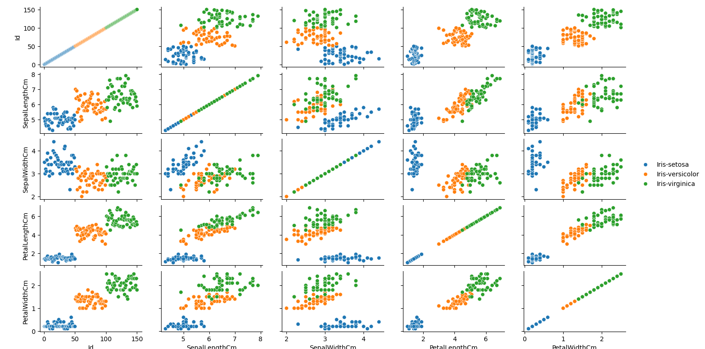
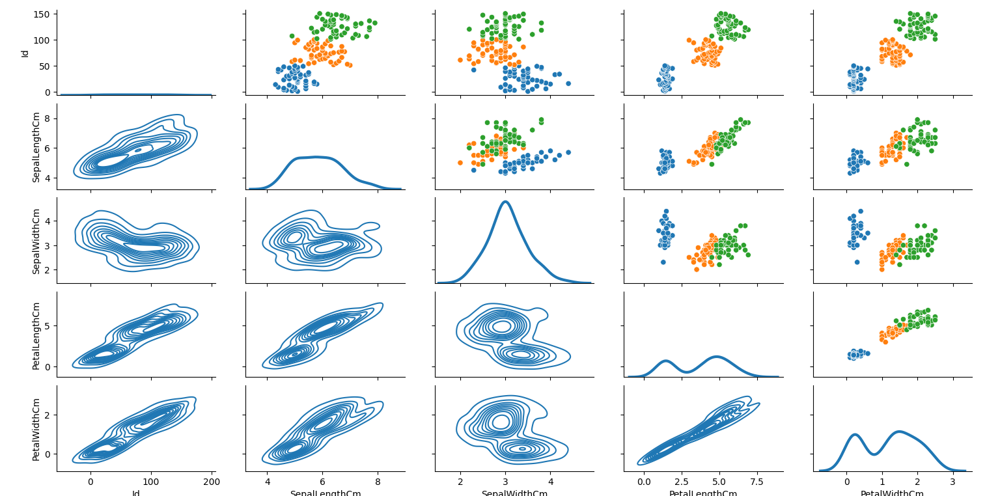
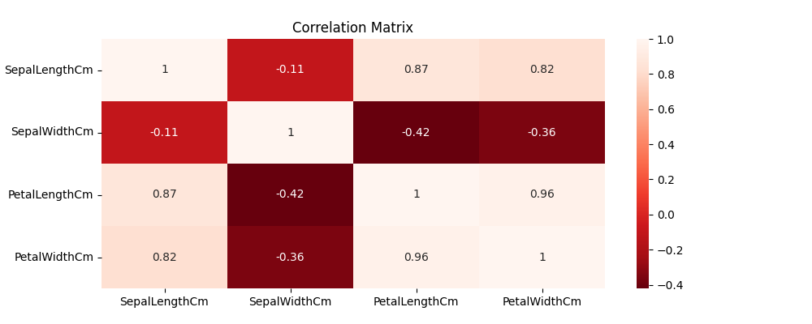
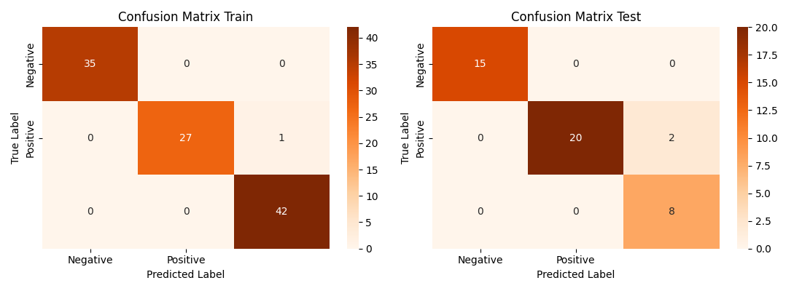
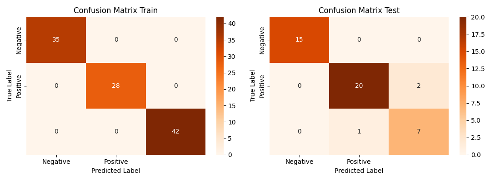
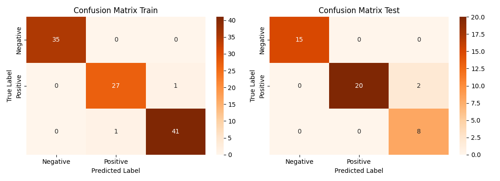

# Iris Flower Classification

Determines the best machine learning model to classify Iris flowers into the correct species (setosa, versicolor, virginica) based on its characteristics (sepal length, sepal width, petal length, petal width).

This project uses numpy, pandas, matplotlib.pyplot, seaborn, and sklearn for metrics, preprocessing, and machine learning models.

## Descriptive Statistics

For each column in the dataset, determine:
- The number of missing values
- The percentage of missing values
- Statistics: Mean, Median, Mode, Standard Deviation, Min, Max, Quartiles

### Sepal Length

There are no missing values in SepalLengthCm, meaning the percentage of missing values is 0%.
The minimum SepalLengthCm is 4.3 while the maximum SepalLengthCm is 7.9. The mean, median and mode were found to be 5.843333333333334, 5.8, and 0    5.0 respectively. The standard deviation of SepalLengthCm is 0.828066127977863. The data spread of SepalLengthCm is outlined in the quartile table below.

| Quartile | SepalLengthCm |
|-|-|
| 0.25| 5.1 |
| 0.50| 5.8 |
| 0.75| 6.4 |

### Sepal Width
There are no missing values in SepalWidthCm, meaning the percentage of missing values is 0%.
The minimum SepalLengthCm is 4.3 while the maximum SepalLengthCm is 7.9. The mean, median and mode were found to be 5.843333333333334, 5.8, and 0    5.0 respectively. The standard deviation of SepalLengthCm is 0.828066127977863. The data spread of SepalLengthCm is outlined in the quartile table below.

| Quartile | SepalLengthCm |
|-|-|
| 0.25| 5.1 |
| 0.50| 5.8 |
| 0.75| 6.4 |

### Petal Length
There are no missing values in PetalLengthCm, meaning the percentage of missing values is 0%.
The minimum PetalLengthCm is 1.0 while the maximum PetalLengthCm is 6.9. The mean, median and mode were found to be 3.758666666666666, 4.35, and 0    1.5 respectively. The standard deviation of PetalLengthCm is 1.7644204199522626. The data spread of PetalLengthCm is outlined in the quartile table below.

| Quartile | PetalLengthCm |
|-|-|
| 0.25| 1.60 |
| 0.50| 4.35 |
| 0.75| 5.10 |

### Petal Width
There are no missing values in PetalWidthCm, meaning the percentage of missing values is 0%.
The minimum PetalWidthCm is 0.1 while the maximum PetalWidthCm is 2.5. The mean, median and mode were found to be 1.1986666666666668, 1.3, and 0    0.2 respectively. The standard deviation of PetalWidthCm is 0.7631607417008411. The data spread of PetalWidthCm is outlined in the quartile table below.

| Quartile | PetalWidthCm |
|-|-|
| 0.25| 0.3 |
| 0.50| 1.3 |
| 0.75| 1.8 |

### Visual Representation of EDA

### Correlations
Using pyplot, create a correlation heatmap of SepalLength, SepalWidth, PetalLength, and PetalWidth.

The above correlation matrix demonstrates the following correlations:
**Positive Correlations**:
- SepalLengthCm and PetalLengthCm with 0.87
- SepalLengthCm and PetalWidthCm with 0.82
- PetalLengthCm and PetalWidthCm with 0.96

**Negative Correlations**:
- SepalLengthCm and SepalWidthCm with -0.11
- PetalLengthCm and SepalWidthCm with -0.42
- PetalWidthCm and SepalWidthCm with -0.36

## Machine Learning Models

Before training any models, use `LabelEncoder()` to encode 'Species' value of the dataframe and drop the original categorical column. 
Then, split the dataframe into train and test data where training data is all columns except species, and the test data is the species column. Next, check the distribution of the dependent variable (`yTrain`) for each species. Finally, create a dataframe to store the scores of each machine learning model.

The method `model_eval()` takes the chosen model, the training data (x,y), and the test data (x,y) and determines the model scores using the following process:
- Fit the given model using `xTrain` and `yTrain`
- Make predictions (`yPredictTrain` and `yPredictTest`) on the trained model using `xTrain` and `xTest`
- Calculates the confusion matrix by determining  ROC_AUC score of the train and test data 
    - Since there are 3 classes, this is a 3x3 matrix summarizing model performance:

    ||Predicted X | Predicted Y | Predicted Z|
    |---|------------|-------------|------------|
    |Actual X| TP| FN | FN |
    |Actual Y| FN | TP | FN |
    |Actual Z| FN | FN | TP |

- Plots the confusion matrix for train and test data using seaborn and pyplot
- Prints a classification report for train and test data
- Calculates and returns model scores as lists - recall_train, recall_test, precision_train, precision_test, f1_train, f1_test

### Logistic Regression 

Using the confusion matrices, we can determine the following:
**Training Data**:
- True positive for class X is 35
- True positive for class Y  is 27
- True positive for class Z  is 42
- False negative for class Y and class Z is 1
**Test Data**:
- True positive for class X is 15
- True positive for class Y  is 20
- True positive for class Z  is 8
- False negative for class Y and class Z is 2

Classification Report Train
|              |   precision |   recall |   f1-score |    support |
|:-------------|------------:|---------:|-----------:|-----------:|
| 0            |    1        | 1        |   1        |  35        |
| 1            |    1        | 0.964286 |   0.981818 |  28        |
| 2            |    0.976744 | 1        |   0.988235 |  42        |
| accuracy     |    0.990476 | 0.990476 |   0.990476 |   0.990476 |
| macro avg    |    0.992248 | 0.988095 |   0.990018 | 105        |
| weighted avg |    0.990698 | 0.990476 |   0.990446 | 105        |

Classification Report Test
|              |   precision |   recall |   f1-score |   support |
|:-------------|------------:|---------:|-----------:|----------:|
| 0            |    1        | 1        |   1        | 15        |
| 1            |    1        | 0.909091 |   0.952381 | 22        |
| 2            |    0.8      | 1        |   0.888889 |  8        |
| accuracy     |    0.955556 | 0.955556 |   0.955556 |  0.955556 |
| macro avg    |    0.933333 | 0.969697 |   0.94709  | 45        |
| weighted avg |    0.964444 | 0.955556 |   0.956966 | 45        |

##### Logistic Regression Tuned

The logistic regression model was tuned with **GridSearchCV** which does an exhaustive search over a given parameter grid to find the optimal hyperparameters. The parameter space is quite small so GridSearchCV is a good choice.

Using the confusion matrices, we can determine the following:
**Training Data**:
- True positive for class X is 35
- True positive for class Y  is 28
- True positive for class Z  is 42
**Test Data**:
- True positive for class X is 15
- True positive for class Y  is 20
- True positive for class Z  is 8
- False negative for class Y and class Z is 2

Classification Report Train
|              |   precision |   recall |   f1-score |   support |
|:-------------|------------:|---------:|-----------:|----------:|
| 0            |           1 |        1 |          1 |        35 |
| 1            |           1 |        1 |          1 |        28 |
| 2            |           1 |        1 |          1 |        42 |
| accuracy     |           1 |        1 |          1 |         1 |
| macro avg    |           1 |        1 |          1 |       105 |
| weighted avg |           1 |        1 |          1 |       105 |

 Classification Report Test
|              |   precision |   recall |   f1-score |   support |
|:-------------|------------:|---------:|-----------:|----------:|
| 0            |    1        | 1        |   1        | 15        |
| 1            |    1        | 0.909091 |   0.952381 | 22        |
| 2            |    0.8      | 1        |   0.888889 |  8        |
| accuracy     |    0.955556 | 0.955556 |   0.955556 |  0.955556 |
| macro avg    |    0.933333 | 0.969697 |   0.94709  | 45        |
| weighted avg |    0.964444 | 0.955556 |   0.956966 | 45        |

#### Results

|              |   Logistic Regression |   Logistic Regression Tuned | 
|:-------------|------------:|---------:|
| Precision Train            |     0.990698        | 1.000000        |
| Precision Test          |    0.964444        | 0.964444 |
| Recall Train            |    0.990476      | 1.000000        |
| Recall Test     |    0.955556 | 0.955556 | 
| Accuracy Train    |    0.990476 | 1.000000 |
| Accuracy Test |    0.955556 | 0.955556 |
| F1 Train |    0.990446 | 1.000000 |
| F1 Test |    0.956966 | 0.956966 |

All of the scores of the original and tuned model are virually the same, indicating that hyperparameter tuning did not improve the model.

### Decision Tree

Using the confusion matrices, we can determine the following:
**Training Data**:
- True positive for class X is 35
- True positive for class Y  is 28
- True positive for class Z  is 42
**Test Data**:
- True positive for class X is 15
- True positive for class Y  is 20
- True positive for class Z  is 7
- False negative for class Y and class Z is 2

Classification Report Train
|              |   precision |   recall |   f1-score |   support |
|:-------------|------------:|---------:|-----------:|----------:|
| 0            |           1 |        1 |          1 |        35 |
| 1            |           1 |        1 |          1 |        28 |
| 2            |           1 |        1 |          1 |        42 |
| accuracy     |           1 |        1 |          1 |         1 |
| macro avg    |           1 |        1 |          1 |       105 |
| weighted avg |           1 |        1 |          1 |       105 |

 Classification Report Test
|              |   precision |   recall |   f1-score |   support |
|:-------------|------------:|---------:|-----------:|----------:|
| 0            |    1        | 1        |   1        | 15        |
| 1            |    0.952381 | 0.909091 |   0.930233 | 22        |
| 2            |    0.777778 | 0.875    |   0.823529 |  8        |
| accuracy     |    0.933333 | 0.933333 |   0.933333 |  0.933333 |
| macro avg    |    0.910053 | 0.92803  |   0.917921 | 45        |
| weighted avg |    0.937213 | 0.933333 |   0.934519 | 45        |

##### Decision Tree Tuned

Again, this model was tuned with **GridSearchCV** for the same reasons outlined above.

 Classification Report Train
|              |   precision |   recall |   f1-score |    support |
|:-------------|------------:|---------:|-----------:|-----------:|
| 0            |    1        | 1        |   1        |  35        |
| 1            |    0.964286 | 0.964286 |   0.964286 |  28        |
| 2            |    0.97619  | 0.97619  |   0.97619  |  42        |
| accuracy     |    0.980952 | 0.980952 |   0.980952 |   0.980952 |
| macro avg    |    0.980159 | 0.980159 |   0.980159 | 105        |
| weighted avg |    0.980952 | 0.980952 |   0.980952 | 105        |

 Classification Report Test
|              |   precision |   recall |   f1-score |   support |
|:-------------|------------:|---------:|-----------:|----------:|
| 0            |    1        | 1        |   1        | 15        |
| 1            |    1        | 0.909091 |   0.952381 | 22        |
| 2            |    0.8      | 1        |   0.888889 |  8        |
| accuracy     |    0.955556 | 0.955556 |   0.955556 |  0.955556 |
| macro avg    |    0.933333 | 0.969697 |   0.94709  | 45        |
| weighted avg |    0.964444 | 0.955556 |   0.956966 | 45        |

#### Results
|              |   Logistic Regression |   Logistic Regression Tuned | Decision Tree| Decision Tree Tuned|
|:-------------|------------:|---------:|---------:|---------:|
| Precision Train  |    0.990698 | 1.000000 | 1.000000 | 0.980952 |
| Precision Test   |    0.964444 | 0.964444 | 0.937213 | 0.964444 |
| Recall Train     |    0.990476 | 1.000000 | 1.000000 | 0.980952 |
| Recall Test      |    0.955556 | 0.955556 | 0.933333 | 0.955556 |
| Accuracy Train   |    0.990476 | 1.000000 | 1.000000 | 0.980952 |
| Accuracy Test    |    0.955556 | 0.955556 | 0.933333 | 0.955556 |
| F1 Train         |    0.990446 | 1.000000 | 1.000000 | 0.980952 |
| F1 Test          |    0.956966 | 0.956966 | 0.934519 | 0.956966 |

All of the scores of the original and tuned model are virually the same, indicating that hyperparameter tuning did not improve the model. In fact, some of the scores of the tuned model are less than the untuned model.

### Random Forest

Using the confusion matrices, we can determine the following:
**Training Data**:
- True positive for class X is 35
- True positive for class Y  is 28
- True positive for class Z  is 42
**Test Data**:
- True positive for class X is 15
- True positive for class Y  is 20
- True positive for class Z  is 8
- False negative for class Y and class Z is 2

Classification Report Train
|              |   precision |   recall |   f1-score |   support |
|:-------------|------------:|---------:|-----------:|----------:|
| 0            |           1 |        1 |          1 |        35 |
| 1            |           1 |        1 |          1 |        28 |
| 2            |           1 |        1 |          1 |        42 |
| accuracy     |           1 |        1 |          1 |         1 |
| macro avg    |           1 |        1 |          1 |       105 |
| weighted avg |           1 |        1 |          1 |       105 |

 Classification Report Test
|              |   precision |   recall |   f1-score |   support |
|:-------------|------------:|---------:|-----------:|----------:|
| 0            |    1        | 1        |   1        | 15        |
| 1            |    1        | 0.909091 |   0.952381 | 22        |
| 2            |    0.8      | 1        |   0.888889 |  8        |
| accuracy     |    0.955556 | 0.955556 |   0.955556 |  0.955556 |
| macro avg    |    0.933333 | 0.969697 |   0.94709  | 45        |
| weighted avg |    0.964444 | 0.955556 |   0.956966 | 45        |

##### Random Forest Tuned
This model was tuned with **RandomizedSearchCV** since the parameter space is larger and a random search over a parameter grid is more efficient than an exhaustive one.

Classification Report Train
|              |   precision |   recall |   f1-score |    support |
|:-------------|------------:|---------:|-----------:|-----------:|
| 0            |    1        | 1        |   1        |  35        |
| 1            |    0.964286 | 0.964286 |   0.964286 |  28        |
| 2            |    0.97619  | 0.97619  |   0.97619  |  42        |
| accuracy     |    0.980952 | 0.980952 |   0.980952 |   0.980952 |
| macro avg    |    0.980159 | 0.980159 |   0.980159 | 105        |
| weighted avg |    0.980952 | 0.980952 |   0.980952 | 105        |

 Classification Report Test
|              |   precision |   recall |   f1-score |   support |
|:-------------|------------:|---------:|-----------:|----------:|
| 0            |    1        | 1        |   1        | 15        |
| 1            |    1        | 0.909091 |   0.952381 | 22        |
| 2            |    0.8      | 1        |   0.888889 |  8        |
| accuracy     |    0.955556 | 0.955556 |   0.955556 |  0.955556 |
| macro avg    |    0.933333 | 0.969697 |   0.94709  | 45        |
| weighted avg |    0.964444 | 0.955556 |   0.956966 | 45        |

#### Results

|              |   Logistic Regression |   Logistic Regression Tuned | Decision Tree| Decision Tree Tuned| Random Forest | Random Forest Tuned|
|:-------------|------------:|---------:|---------:|---------:|---------:|---------:|
| Precision Train  |    0.990698 | 1.000000 | 1.000000 | 0.980952 |1.000000 | 0.980952 |
| Precision Test   |    0.964444 | 0.964444 | 0.937213 | 0.964444 |0.964444 | 0.964444 |
| Recall Train     |    0.990476 | 1.000000 | 1.000000 | 0.980952 |1.000000 | 0.980952 |
| Recall Test      |    0.955556 | 0.955556 | 0.933333 | 0.955556 |0.955556 | 0.955556 |
| Accuracy Train   |    0.990476 | 1.000000 | 1.000000 | 0.980952 |1.000000 | 0.980952 |
| Accuracy Test    |    0.955556 | 0.955556 | 0.933333 | 0.955556 |0.955556 | 0.955556 |
| F1 Train         |    0.990446 | 1.000000 | 1.000000 | 0.980952 |1.000000 | 0.980952 |
| F1 Test          |    0.956966 | 0.956966 | 0.934519 | 0.956966 |0.956966 | 0.956966 |

All of the scores of the original and tuned model are virually the same, indicating that hyperparameter tuning did not improve the model. In fact, some of the scores of the tuned model are less than the untuned model.

### Support Vector Machine

##### Support Vector Machine Tuned

#### Results

### Naive Bayes

### Neural Network (MLP)

## Model Evaluation

## Results