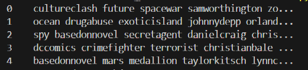
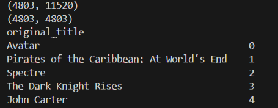
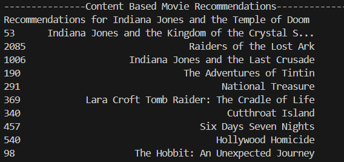
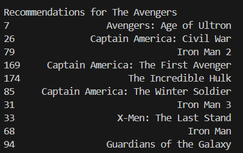

# Content Based Movie Recommendation System

Using a dataset of movies and associated credits, personalize movie recommendations using plot details and movie metadata.

## Data Preprocessing

Read `tmdb_5000_credits.csv` and `tmdb_5000_movies.csv` into dataframes. Then merged `credits` and `movies` into `movies` on the `id` field, as only id, title, cast, and crew of credits were needed.

## Movie Recommendation System

### Feature Extraction & Metadata

Used cast, crew, keywords, and genres as features for recommendations. 
The process of extracting movie metadata is as follows:
1. Convert features into literals
2. Create `director` column by searching through a movie entry for `job=="director"`
3. Add columns for cast, keywords, genres which hold a list of at least 3 values from the entry
4. Clean individual row data by converting to lowercase and removing spaces
5. Create a 'soup' of metadata ie join contents of `features[keywords/cast/director/genres]` into a single string

### Similarity

To determine movie recommendations, convert the 'soup' metadata of movies (`movies['soup']`) into a vector matrix using `CountVectorizer`. Since data is now vectorized, use cosine similarity to determine the similarity score of any 2 entries in the matrix, where -1 is not similar and 1 is identical.

### Mapping

After determining cosine similarity, reset the index of the dataframe.
Then create a reverse mapping of titles to indices, exclulde duplicates.

### Recommendations

The process of determining a recommendation is as follows:
1. Get a list of movie indices by title
2. Get a list of the similarity scores of all movies using the indices
3. Sort the scores in descending order (as closer to 1 means more similar)
4. Create a list of 10 tuples (index, similarity score). These are the top 10 movie recommendations.
5. Get the indices of the top 10 movies
6. Use the indices to determine the original title of the top 10 movies
7. Return the titles of the top 10 movie recommendations

The first recommendation tested was for **Indiana Jones and the Temple of Doom**. The content based recommendation system recommended the following movies:

The second recommendation tested was for **The Avengers**. The content based recommendation system recommended the following movies:

