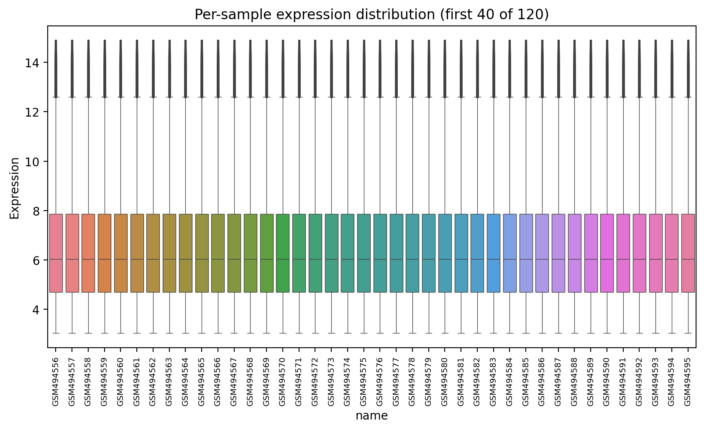
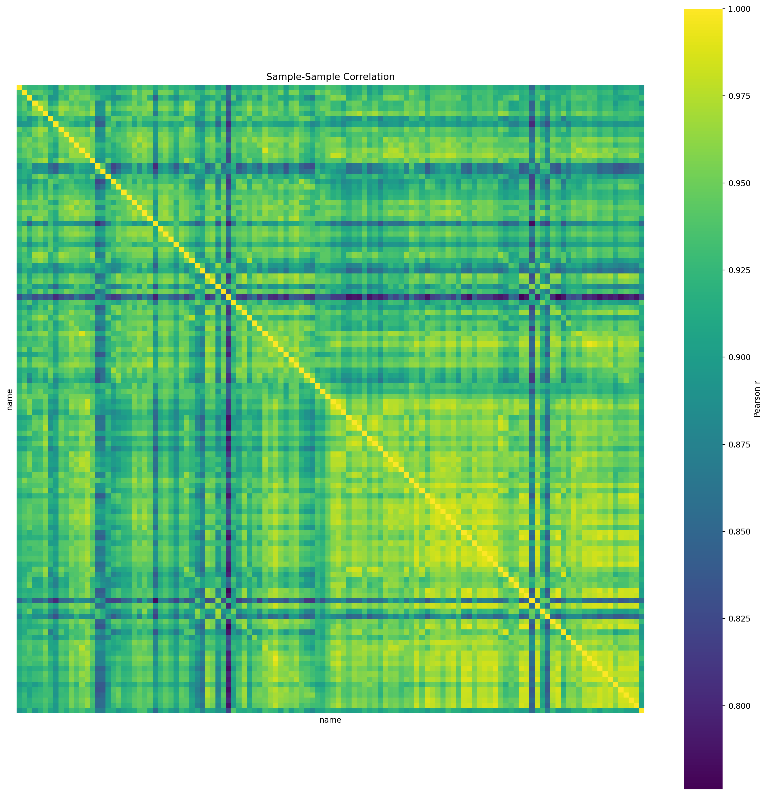
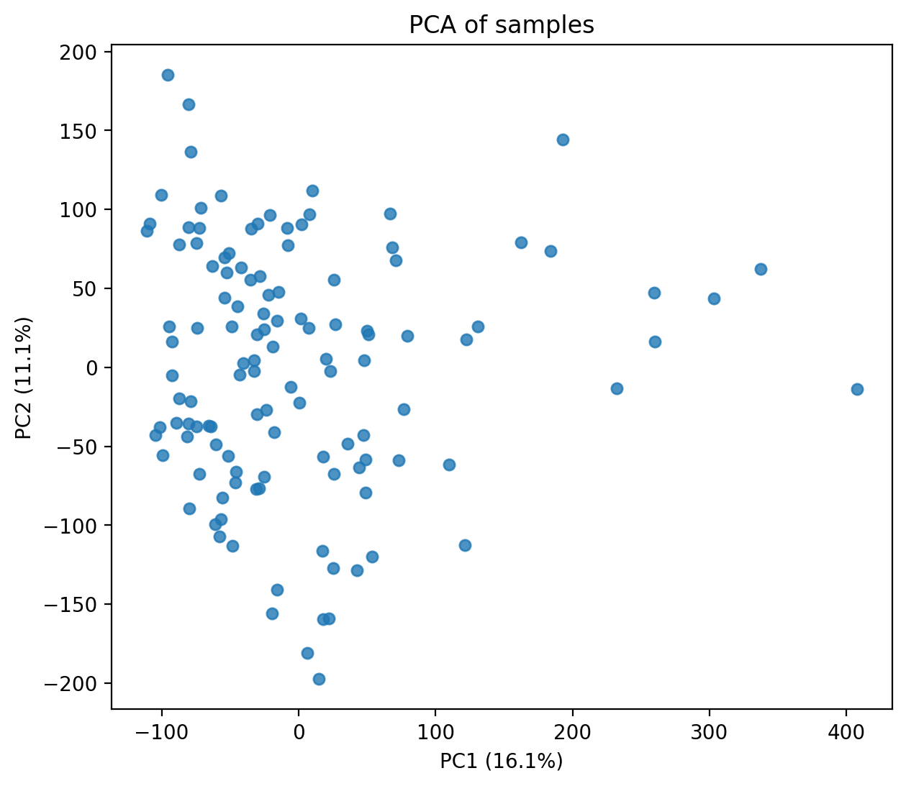
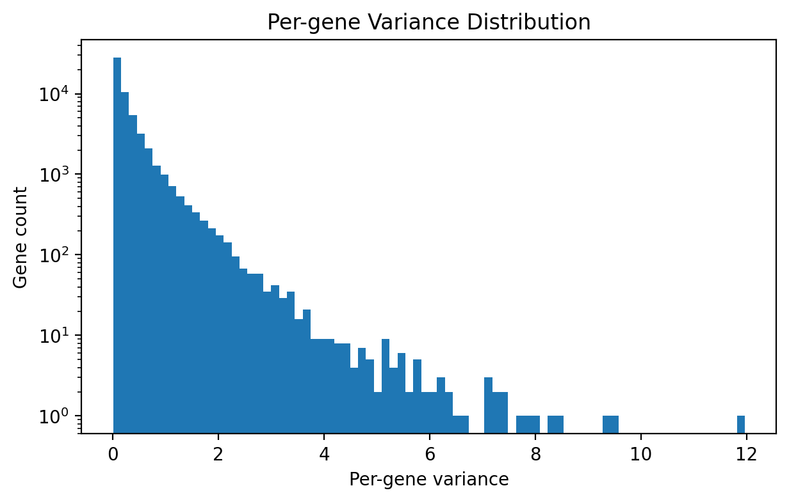
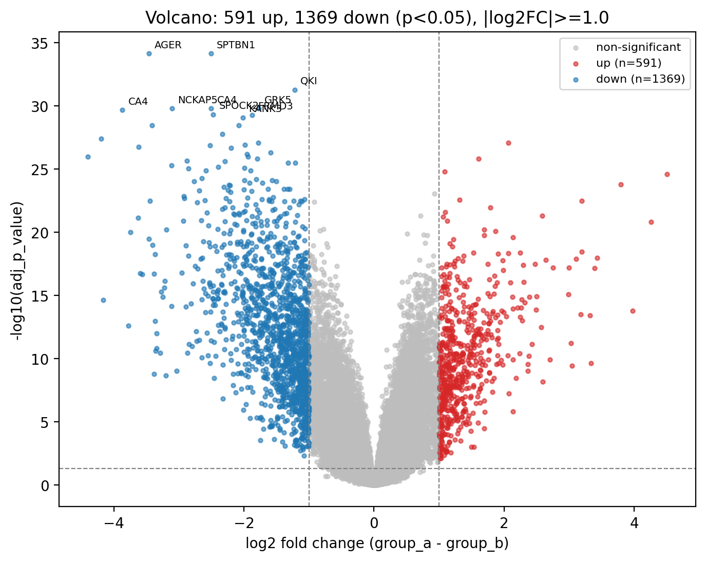
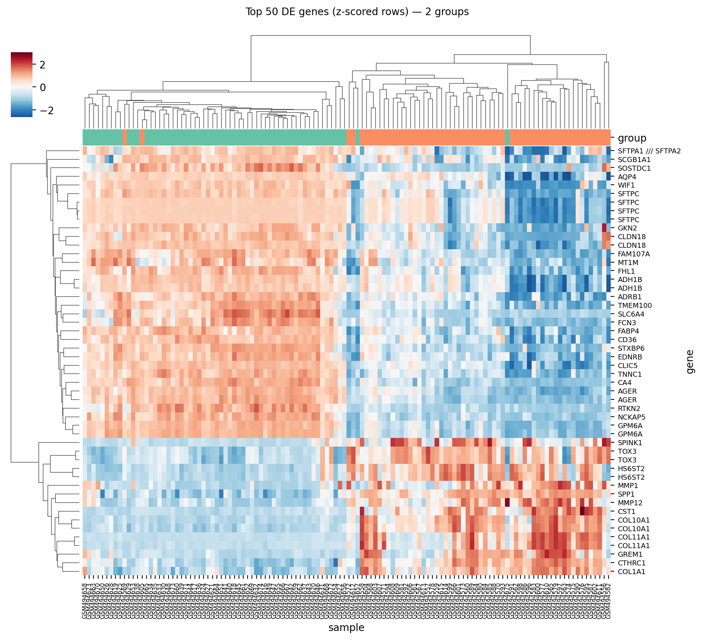
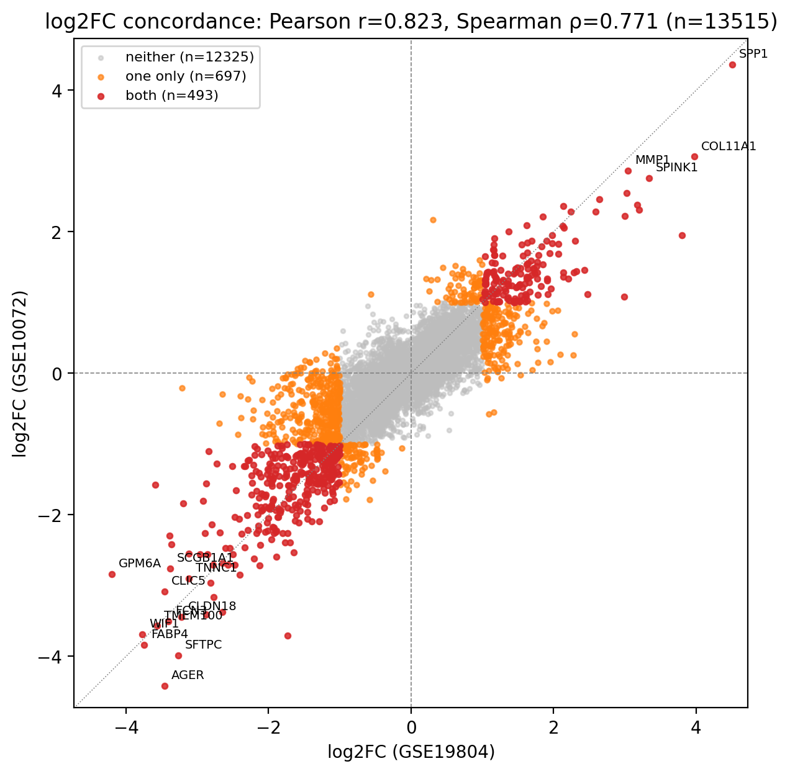

# Gene Expression Analysis

A CLI for analyzing microarray gene expression data from the NCBI Gene Expression Omnibus (GEO). The pipeline auto-downloads a dataset by accession, runs exploratory data analysis, performs differential expression between two sample groups (Welch's t-test with Benjamini–Hochberg FDR correction), renders volcano plots and clustered heatmaps of the top DE genes, and compares results across two datasets to find shared signals and quantify concordance. Validated end-to-end on two independent lung cancer studies, [GSE19804](data/GSE19804_family.soft.gz) and [GSE10072](data/GSE10072_family.soft.gz).

## Usage

```bash
python ge.py <command> [options]
```

Commands: `eda`, `diffex`, `volcano`, `heatmap`, `compare`. All outputs are written under `result/<accession>/` (or `result/compare_<a>_vs_<b>/` for cross-dataset comparisons).

## Entry Points

### [ge.py](ge.py)
CLI orchestrator and the only intended entry point for the project. Parses subcommands (`eda`, `diffex`, `volcano`, `heatmap`, `compare`), loads the requested GEO dataset(s) via [shared_utils](shared_utils.py), and dispatches to the matching module in [src/](src/). Handles group assignment via metadata substring matching, manages `result/<accession>/` output directories, and configures logging. Modules in `src/` expose Python functions only — they are not standalone scripts.

### [shared_utils.py](shared_utils.py)
Pure helpers reused across every `src/` module. Provides `load_geo_dataset` (GEOparse-backed download + cache, returns expression / samples / annotation frames), `assign_groups` (dict, callable, or substring-based group labeling), `normalize` (log2 / quantile / z-score), `differential_expression` (per-gene Welch's t-test with BH FDR correction and optional gene-symbol merge), `top_de_genes` (filter and rank by |log2FC|), plus `detect_log_scale` and `subset_by_group` utilities. All transforms return new frames; only `load_geo_dataset` touches disk.

## Pipeline Modules ([src/](src/))

### [eda.py](src/eda.py)
Runs single-dataset exploratory data analysis and writes one text summary plus four PNG plots to `result/<accession>/eda/`. Outputs include a [summary.txt](result/GSE19804/eda/summary.txt) (gene/sample counts, value range, log-scale detection, NaN fractions, group counts), per-sample expression boxplots (capped at 40 samples for legibility), a sample–sample Pearson correlation heatmap (ordered by group if assigned), a 2-component PCA scatter colored by group, and a per-gene variance histogram on a log y-axis. Expects the caller to have already loaded the dataset and assigned groups via `shared_utils`.

### [diffex.py](src/diffex.py)
Wraps `shared_utils.differential_expression` with three pieces of glue: auto-detects whether the expression matrix is already log-scaled and applies `log2` normalization if not, subsets samples to the two groups under test, and optionally collapses probe-level results to one row per gene symbol (keeping the smallest adjusted p-value). Writes `de.csv` to the output directory and prints the top-10 rows to stdout for quick inspection. The `collapse_to_gene=True` mode is required upstream of [compare.py](src/compare.py).

### [volcano.py](src/volcano.py)
Renders a volcano plot of log2 fold change vs −log10(adjusted p-value) as a static PNG. Points are classified as up-regulated, down-regulated, or non-significant against caller-supplied thresholds (defaults: adj_p < 0.05, |log2FC| ≥ 1.0), with threshold reference lines and a legend showing per-class counts. The N most significant differentially expressed genes are annotated with their gene symbol (or probe ID as fallback). Adjusted p-values are clipped at 1e-300 before the log transform to keep the plot finite.

### [heatmap.py](src/heatmap.py)
Renders a hierarchically clustered sample × gene heatmap of the top DE genes using `seaborn.clustermap`. Selects the gene set via `top_de_genes`, drops zero-variance rows so linkage doesn't crash, z-scores per row, and labels rows with gene symbols where available. A top color bar encodes group membership (Set2 palette). Output is `result/<accession>/heatmap.png`; figure height scales with gene count so labels stay readable.

### [compare.py](src/compare.py)
Performs cross-dataset comparison of two collapsed-to-gene differential expression frames. Inner-joins on `gene_symbol`, classifies each gene as significant in both / one / neither, and writes three artifacts: [shared_de_genes.csv](result/compare_GSE19804_vs_GSE10072/shared_de_genes.csv) (genes significant in both, sorted by combined |log2FC| rank), [log2fc_scatter.png](result/compare_GSE19804_vs_GSE10072/log2fc_scatter.png) (cross-dataset log2FC concordance with diagonal reference and top-N gene labels), and [overlap_summary.txt](result/compare_GSE19804_vs_GSE10072/overlap_summary.txt) (Jaccard index, sign concordance, Pearson r, Spearman ρ). Both inputs must come from `run_diffex(..., collapse_to_gene=True)`.

## Results

The pipeline was run end-to-end on two independent lung adenocarcinoma vs. adjacent-normal microarray studies: **GSE19804** (60 tumor / 60 normal, Affymetrix HG-U133 Plus 2.0) and **GSE10072** (58 tumor / 49 normal, Affymetrix HG-U133A).

### GSE19804 — Single-dataset analysis

EDA summary ([summary.txt](result/GSE19804/eda/summary.txt)): 54,675 probes × 120 samples, value range [3.04, 14.89], median 6.03 — confirmed log-scale, zero missing values.

**EDA plots** ([result/GSE19804/eda/](result/GSE19804/eda/)):


*Per-sample boxplots — distributions are tightly aligned, indicating the GEO submission was already normalized.*


*Sample–sample correlation — strong block structure separates tumor from normal samples.*


*PCA — tumor and normal samples separate cleanly along PC1.*


*Per-gene variance distribution (log y-axis) — heavy right tail of high-variance genes, as expected.*

**Differential expression** ([de.csv](result/GSE19804/de.csv)): top hits include **AGER** (log2FC = −3.46, adj_p ≈ 7e-35), **SPTBN1**, **CA4**, **GPM6A** — all canonical lung tissue / alveolar markers expected to be down-regulated in tumor.


*Volcano plot — significant up- and down-regulated genes flanking the |log2FC| ≥ 1, adj_p < 0.05 thresholds.*


*Clustered heatmap of the top 50 DE genes (z-scored rows) — tumor and normal samples form two distinct clusters.*

### Cross-dataset comparison — GSE19804 vs GSE10072

[overlap_summary.txt](result/compare_GSE19804_vs_GSE10072/overlap_summary.txt):

| Metric | Value |
|---|---|
| Genes joined on `gene_symbol` (inner) | 13,515 |
| Significant in GSE19804 | 1,342 |
| Significant in GSE10072 | 650 |
| Significant in **both** | **493** |
| Jaccard index | 0.329 |
| Sign concordance | **1.0000** (493/493) |
| Pearson r (joined log2FC) | 0.823 |
| Spearman ρ (joined log2FC) | 0.771 |


*Cross-dataset log2FC concordance — points cluster along the diagonal, and every one of the 493 shared significant genes agrees in direction.*

**Interpretation.** Two independently collected lung cancer cohorts on different array platforms recover overlapping differentially expressed gene sets (Jaccard 0.33) with **perfect sign concordance** on the shared set and strong fold-change correlation (Pearson r = 0.82). The top concordant genes — **SPP1**, **AGER**, **FABP4**, **WIF1**, **SFTPC**, **MMP1**, **COL11A1** — are well-established lung adenocarcinoma markers, providing strong cross-cohort validation that the pipeline recovers biologically meaningful signal.
